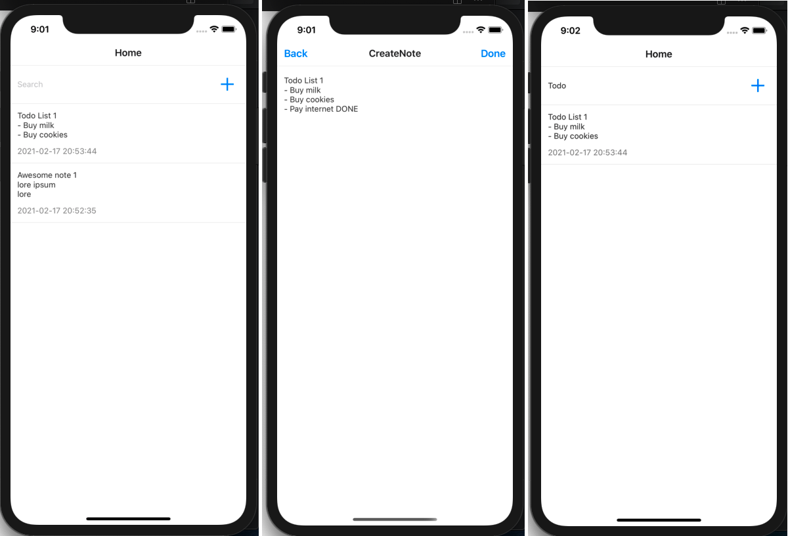
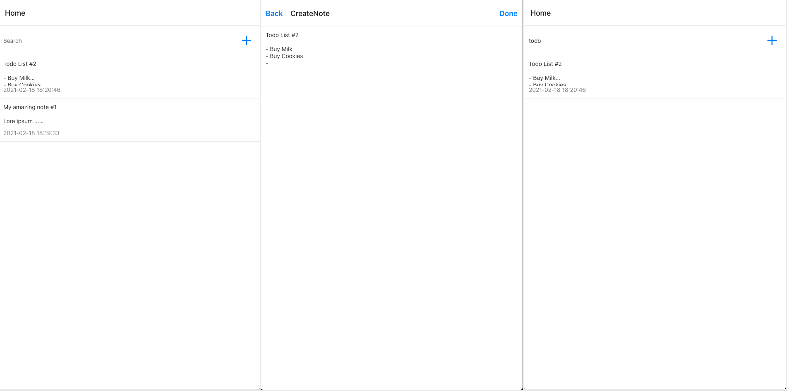

# Note App

A small React Native proof of concept built with Expo

## Getting Started

### Cloning

`$ git clone https://github.com/lucasrocali/note-app.git`

`$ cd note-app`

### Installing

`$ yarn install`

### Running 

`$ yarn ios`

`$ yarn android`

`$ yarn web`

## Built With

- [Expo](https://github.com/expo/expo) - Developer Tool
- [React-Navigation](https://github.com/react-navigation/react-navigation) - Routing and navigation 
- [Styled-Components](https://github.com/styled-components/styled-components) - Styles and Theme
- [zustand](https://github.com/pmndrs/zustand) - State management

## Features

- List notes
- Create a note
- Edit a note
- Filter a note